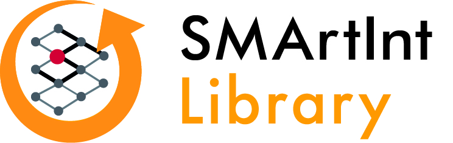

The **SMArtInt Library** is designed to integrate various artificial intelligence (AI) models seamlessly into Modelica-based simulation tools. **SMArtInt**, short for **S**imple **M**odelica **Art**ificial **I**ntelligence I**nt**erface, provides a user-friendly interface that bridges advanced AI capabilities with the power of Modelica simulations, enhancing both modeling efficiency and simulation accuracy.

Currently, it supports the following tools
1. Dymola
2. OpenModelica

with 

1. TensorFlow models exported as TFLite
2. ONNX models.

The repository contains a compiled version of the interface for usage in windows. __As a starting point open the Modelica Library. It contains some ready to run examples (SMartInt.Tester) which demonstrate the usage.__ The corresponding python files which create the TF-Lite and ONNX models are located in Resources\ExampleNeuralNets.

Hints for usage in Dymola:
Currently, only a 64-bit version is available. If the variable Advanced.CompileWith64 is set on its default value 0, Dymola will automatically compile a 64-bit Dymosim.exe after giving a remark in the translate log file. In case Advanced.CompileWith64=2 a 64-bit dymosim.exe is created anyway and in case of Advanced.CompileWith64=1 compilation will fail.

SMArtInt uses other software - the source code is included as submodule and/or as compiled version for direct usage_
1. Tensorflow (https://github.com/tensorflow/tensorflow)
* License: https://github.com/tensorflow/tensorflow/blob/master/LICENSE
2. Bazel.exe (https://github.com/bazelbuild/bazel)
* License: https://github.com/bazelbuild/bazel/blob/master/LICENSE
3. ClaRa Delay (https://github.com/xrg-simulation/ClaRaDelay)
* License: https://github.com/xrg-simulation/ClaRaDelay/blob/main/LICENSE
4. ONNX Runtime (https://github.com/microsoft/onnxruntime)
* License: https://github.com/microsoft/onnxruntime/blob/main/LICENSE

This work was carried out within the framework of the research project DIZPROVI, supported by the Federal Ministry of Education and Research (number 03WIR0105E).

## Devcontainer

This project includes a pre-configured Visual Studio Code Devcontainer, which provides a consistent and reproducible development environment for all Python-related tasks.

### Working with the Devcontainer

To use the devcontainer, you need to have [Docker](https://www.docker.com/products/docker-desktop/) and the [VS Code Dev Containers extension](https://marketplace.visualstudio.com/items?itemName=ms-vscode-remote.remote-containers) installed.

Once installed, open the project folder in VS Code. You will be prompted to "Reopen in Container". This will build the Docker image and connect your VS Code instance to the environment, giving you access to a terminal and all tools directly within the container.

The environment comes with Python, Jupyter, OMPython, and all other necessary libraries pre-installed, allowing you to run the simulation notebooks and other Python scripts without any local setup.

### Managing Dependencies and Relocking

The Python dependencies for the devcontainer are managed by Conda and pip, with versions pinned in lock files for reproducibility.

*   **Conda:** `.devcontainer/linux_64.env.lock`
*   **Pip:** `.devcontainer/requirements.linux64.txt`

If you need to add or update a dependency, you should first modify the source file (`.devcontainer/environment.yml`) and then regenerate the lock files.

**Workflow for updating dependencies:**

1.  Modify `.devcontainer/environment.yml` with your desired changes.
2.  From the terminal *inside the running devcontainer* create a new environment:
    ```bash
    micromamba create -n upgrade -f .devcontainer/environment.yml
    ```
3.  Execute the following commands to regenerate the lock files:
    ```bash
    # For conda packages
    micromamba env export --explicit -n upgrade > .devcontainer/linux_64.env.lock 

    # For pip packages (if any were added to environment.yml)
    micromamba activate upgrade
    pip freeze| grep -v file > .devcontainer/requirements.linux64.txt
    ```
4.  Rebuild container to ensure new environment is functional.
5.  Commit the updated `environment.yml` along with the newly generated lock files to version control.

